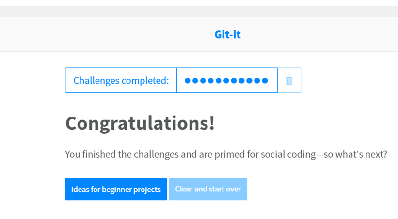

# Name- Chandni Thakkar
	

## Where are you from?

I am from small town vyara located in south gujarat in India. I am indian citizen but i am permanent resident of united states. In united states i live in Kane county, Elgin, Illinois.

## IT Interest

I am working as techical support analyst at ntt data from 2017. I am interested in working with data and learning about the data. I like to find underlying patterns and information from data.

## Something Interesting About You

I am professional dancer and choregorapher with multiple medals.

## Git-IT Tutorial Badge

------------------------------------------------------------------------------------------------------------------------------
# Tooling Setup Assignment

## 1. Installation of PowerShell Core for Windows

## 2. Package Managers for Windows and MacOS

## 3. Install Git, Vagrant, Packer, VScode, Vim

## 4. Install VirtualBox

## 5. Install Vagrant

## 6. Install Packer.io

 -packer.PNG)

## 7. Install IDE editor

## 8. Git-It Tutorial

